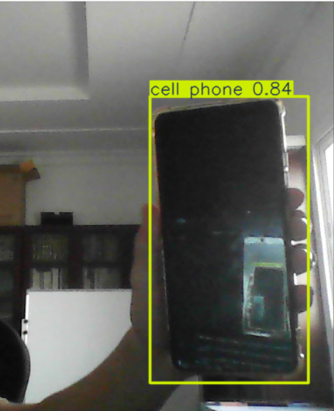

# Object Detection using OpenCV and YOLOv8

## 📌 Project Overview

This project demonstrates real-time object detection using OpenCV and the YOLOv8 deep learning model. The application captures live video from the webcam, detects multiple objects, draws bounding boxes around them, and displays their class names with confidence scores.

The project uses a pre-trained YOLOv8 model, allowing accurate object detection without training a custom dataset.


## 🎯 Objectives

- Detect objects in real time.
- Display object names and confidence scores.
- Draw bounding boxes around detected objects.
- Demonstrate the integration of OpenCV with a modern AI object detection model.


## 🛠 Technologies Used

- Python 3
- OpenCV
- Ultralytics YOLOv8


## 📁 Project Structure

```
Object-Detection-OpenCV/
│
├── app.py
├── requirements.txt
├── README.md
├── yolov8n.pt
└── result1.png
```


### 2. Open the project folder

```bash
cd Object-Detection-OpenCV
```

### 3. Install the required libraries

```bash
pip install -r requirements.txt
```

Or install manually

```bash
pip install ultralytics opencv-python
```

---

## ▶ Running the Project

Run the application using:

```bash
python app.py
```

The webcam will open automatically.

Detected objects will be highlighted with bounding boxes and labels.

Press **Q** to exit the program.

---

## 💡 How It Works

1. Open the webcam using OpenCV.
2. Load the YOLOv8 pre-trained model.
3. Process each video frame.
4. Detect objects inside the frame.
5. Draw bounding boxes.
6. Display the detected object names.
7. Continue until the user presses **Q**.

---
## Sample Results

### Result 1



## 📦 Requirements

```
opencv-python
ultralytics
```

---

## 📈 Features

- Real-time object detection
- Webcam support
- Bounding boxes
- Object labels
- Confidence scores
- Fast YOLOv8 inference
- Easy to use
- Lightweight implementation

---

## 🚀 Future Improvements

- Detect custom objects.
- Save detected images automatically.
- Record detected videos.
- Count detected objects.
- Improve detection accuracy using a custom-trained model.

---

## 👨‍💻 Author

Created as an OpenCV Object Detection course project using Python and YOLOv8.
